# WebApp Framework – Minimalist HTTP Server in Java

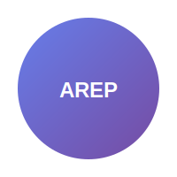

## 📋 Overview

A lightweight, sequential HTTP server built from scratch in Java 21, featuring a custom IoC (Inversion of Control) microframework. This project demonstrates enterprise architecture principles by implementing a web server capable of serving static content and dynamic endpoints through annotation-based controllers.

### 🎯 Academic Objective

**Enterprise Architecture Exercise (AREP) – Workshop 3**  
*Julio Garavito Colombian School of Engineering*

This project explores fundamental concepts of web server implementation, reflection, dependency injection, and dynamic routing in Java, serving as a foundation for understanding distributed architectures and microservices.

## ✨ Key Features

### Core Server Capabilities
- **Custom HTTP Server**: Built from scratch without external web frameworks
- **Static Content Delivery**: Serves HTML, CSS, JavaScript, PNG, SVG, and other static assets
- **MIME Type Detection**: Automatic content-type resolution
- **Error Handling**: Comprehensive 400, 404, and 500 error responses
- **CORS Support**: Open CORS policy for GET/POST/OPTIONS requests

### IoC Microframework
- **Annotation-Driven**: Uses `@RestController`, `@GetMapping`, and `@RequestParam`
- **Automatic Discovery**: Scans classpath for annotated controllers
- **Dependency Injection**: Parameter injection through annotations
- **Dynamic Routing**: Routes are registered automatically at startup

## 🏗️ Architecture

### System Architecture
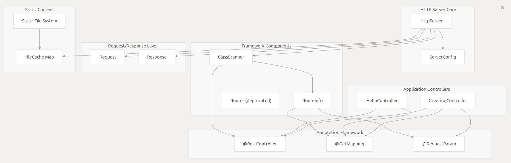

### Request Flow
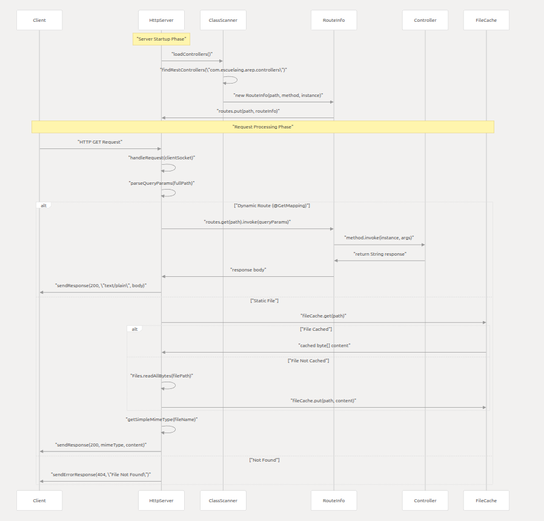

The server follows a simple request-response cycle:
1. Client sends HTTP request
2. Server parses request and determines routing
3. Static files are served directly or dynamic endpoints are invoked
4. Response is formatted and sent back to client

## 💡 Framework Usage

### Creating Controllers

```java
import com.escuelaing.arep.annotations.GetMapping;
import com.escuelaing.arep.annotations.RequestParam;
import com.escuelaing.arep.annotations.RestController;

@RestController
public class DemoController {
    
    @GetMapping("/hello")
    public String hello(@RequestParam(value = "name", defaultValue = "World") String name) {
        return "Hello " + name;
    }
    
    @GetMapping("/api/status")
    public String getStatus() {
        return "Server is running";
    }
}
```

### Automatic Controller Discovery

The framework uses reflection to:
- Scan the classpath for `@RestController` annotated classes
- Register methods annotated with `@GetMapping`
- Configure parameter injection using `@RequestParam`
- Build the routing table dynamically

No manual configuration required – just add annotations and the framework handles the rest.

## 🚀 Getting Started

### Prerequisites

- **Java 21+** (Required)
- **Maven 3.6+** (Build tool)
- **Docker 24+** (Optional, for containerization)

### Installation & Execution

#### Method 1: Maven Direct Execution (Recommended)

```bash
# Clone the repository
git clone https://github.com/diegcard-arep/arep-taller-4.git
cd arep-taller-4

# Compile the project
mvn clean compile

# Run the server
java -cp target/classes com.escuelaing.arep.HttpServer
```

#### Method 2: Standalone JAR

```bash
# Build JAR package
mvn clean package

# Run from JAR
java -jar target/urlobject-1.0-SNAPSHOT.jar
```

#### Method 3: Docker Deployment

```bash
# Using Docker Compose (Recommended)
docker-compose up --build

# Or build and run manually
docker build -t arep-taller-4 .
docker run -p 35000:35000 --name arep-taller-4 diegcard/arep-taller-4:latest
```

### Accessing the Application

Once started, access the application at:
```
http://localhost:35000
```

> [!TIP]
> Static files are served from `target/classes/static`. Ensure you compile the project before running so resources are available in the classpath.

### Docker Deployment

```bash
# Build Docker image
docker build -t arep-taller-4 .
# Run Docker container
docker run -p 35000:35000 --name arep-taller-4 diegcard/arep-taller-4:latest
```

Since the application is contained in a Docker container, it can be deployed on any platform that supports Docker, such as AWS, Google Cloud, Azure, Heroku, among others. This example will show how to deploy it on AWS EC2.

Verify that we have the image on EC2.

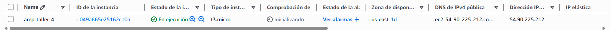

Then log in to the EC2 image.

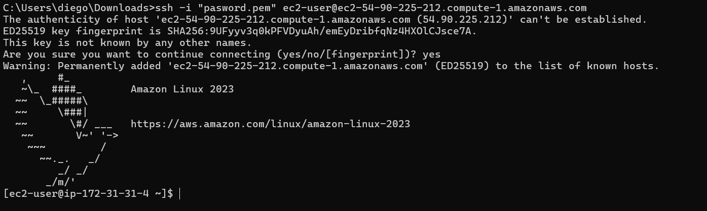

Create an EC2 instance on AWS. You must ensure that you install Docker when you create the instance:

```bash
sudo yum update -y
sudo yum install docker
sudo service docker start
sudo usermod -a -G docker ec2-user
```

Verify the security port configuration on EC2.

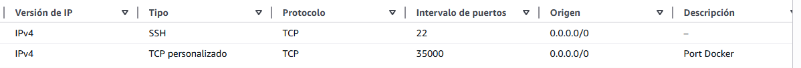

Then run the Docker container:

```bash
docker run -p 35000:35000 --name arep-taller-4 diegcard/arep-taller-4:latest
```

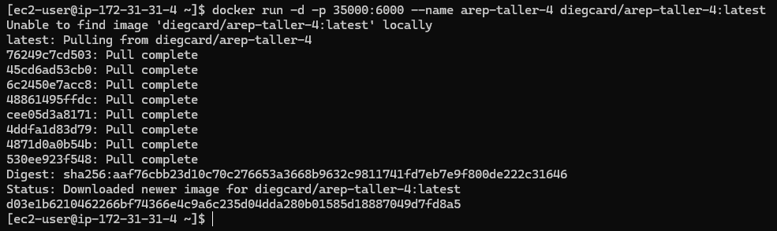

We use the public IP of the EC2 instance to access the application.

Then we verify that the application is running.

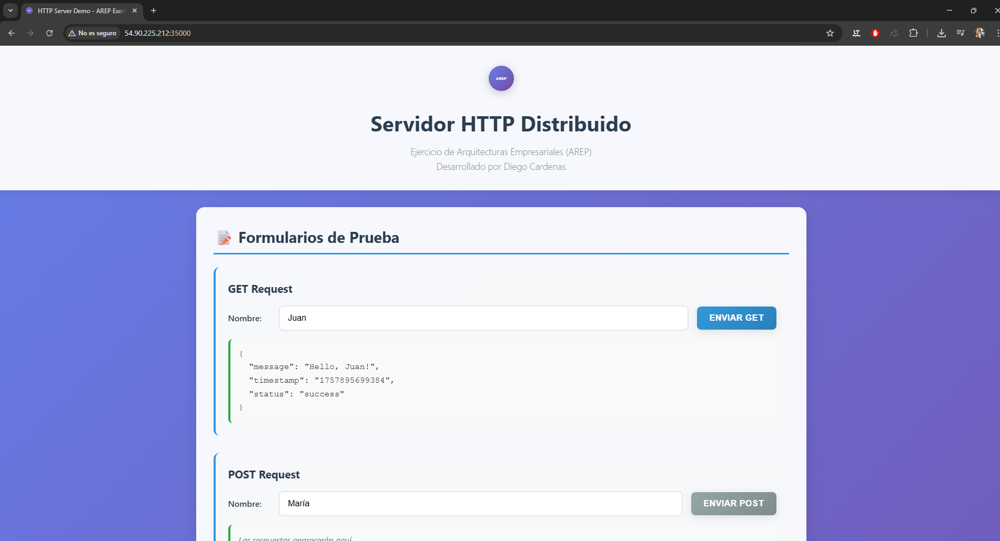

Using Postman, we verify the endpoints.

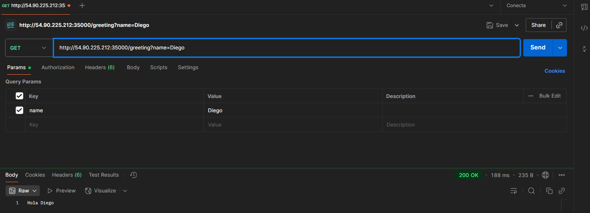

### Video de Prueba de funcionamiento

https://youtu.be/TjGrRkTWKBM

## 🔧 Configuration

### Server Port Configuration

```java
import com.escuelaing.arep.config.ServerConfig;

// Change default port (35000)
ServerConfig.setPort(8080);
```

### Static Files Directory

```java
import com.escuelaing.arep.HttpServer;

// Default static directory
HttpServer.setStaticFilesDirectory("/static");

// Alternative path
HttpServer.setStaticFilesDirectory("src/main/resources/static");
```

### Supported MIME Types

| Extension | MIME Type |
|-----------|-----------|
| html, htm | text/html |
| css | text/css |
| js | application/javascript |
| png | image/png |
| jpg, jpeg | image/jpeg |
| gif | image/gif |
| svg | image/svg+xml |
| ico | image/x-icon |
| txt | text/plain |

## 🛣️ Available Endpoints

### Implemented Routes

| Method | Endpoint | Description | Parameters |
|--------|----------|-------------|------------|
| GET | `/hello` | Basic greeting message | None |
| GET | `/greeting` | Customizable greeting | `name` (optional, default: "World") |
| GET | `/count` | Incrementing counter | None |

### Example Requests

```bash
# Basic greeting
curl http://localhost:35000/hello

# Custom greeting
curl http://localhost:35000/greeting?name=Diego

# Counter endpoint
curl http://localhost:35000/count
```

> [!NOTE]
> The UI includes buttons for `/api/hello`, `/api/weather`, and `/api/quote` as demonstration examples. These endpoints return 404 until implemented.

## 🧪 Testing

### Running Tests

```bash
# Execute unit tests
mvn test

# Run with coverage report
mvn test jacoco:report
```

### Test Results
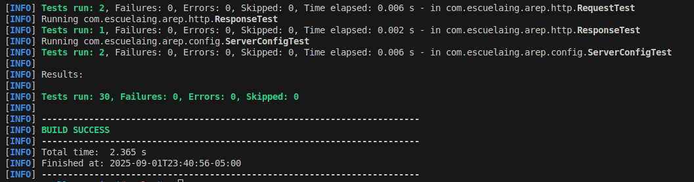

### Test Coverage Areas

- **Request/Response Processing**: HTTP parsing and response generation
- **Controller Discovery**: `ClassScanner` and `RouteInfo` functionality  
- **Routing System**: Dynamic endpoint registration and invocation
- **Controller Examples**: `HelloController` and `GreetingController` validation
- **Server Integration**: Basic `HttpServer` functionality

## 📊 API Testing with Postman

Comprehensive endpoint testing performed with Postman:

### GET /hola
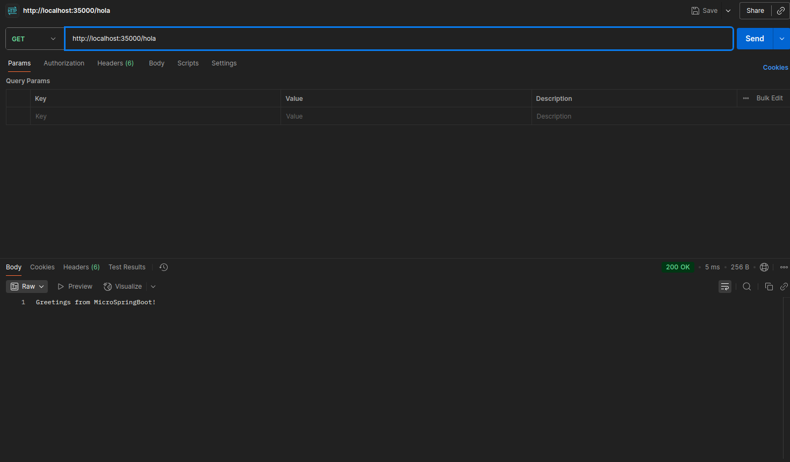

### GET /greeting (Default)
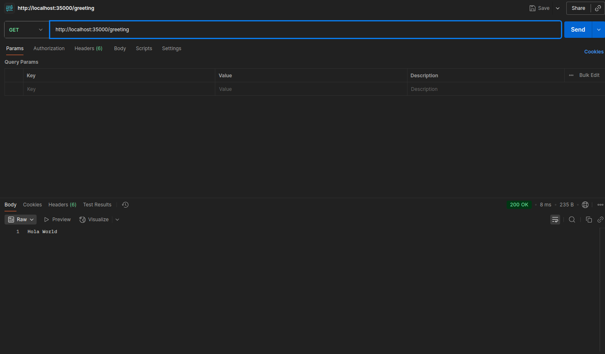

### GET /greeting with Parameters
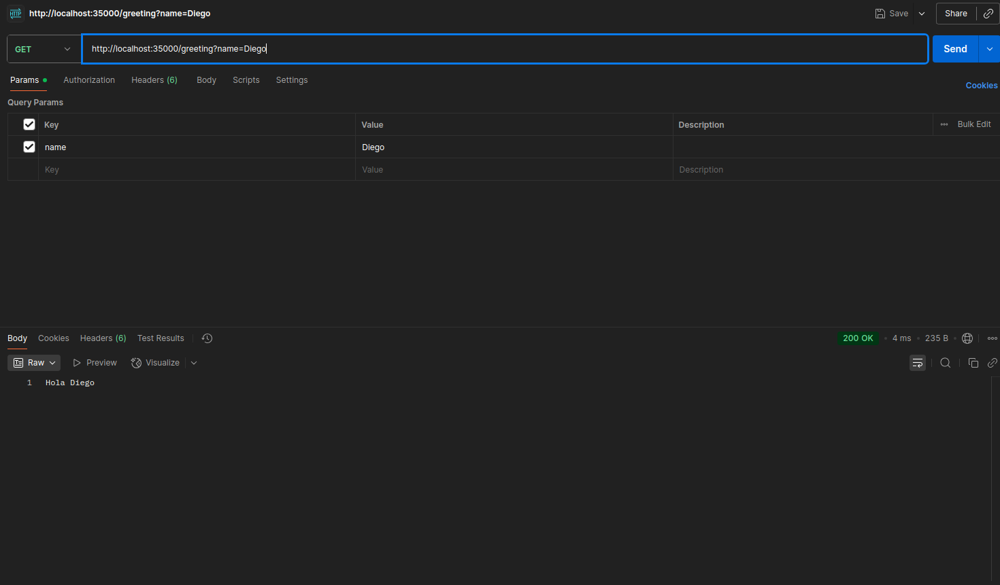

### GET /count
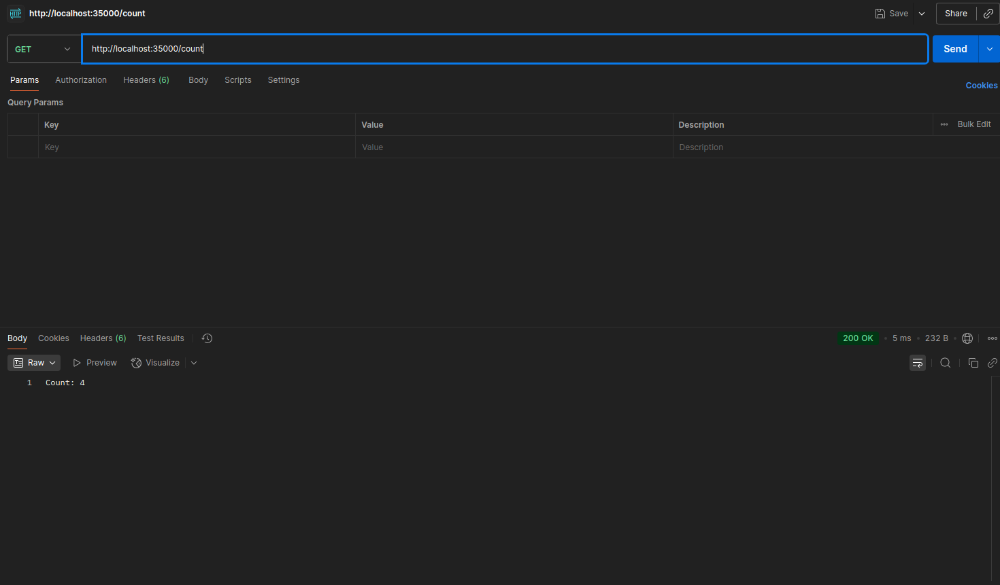

## ⚠️ Current Limitations

### Known Constraints
- **Concurrency**: Sequential processing (one request at a time)
- **HTTP Methods**: Only GET mapping implemented (POST/PUT/DELETE pending)
- **File Caching**: Basic caching without LRU/LFU policies or memory limits
- **Content Negotiation**: No automatic JSON serialization
- **JAR Scanning**: Cannot discover classes within JAR files
- **Development Features**: No hot-reload or template engine support

### Future Enhancements
- Multi-threaded request handling
- Complete HTTP method support
- Advanced caching strategies
- JSON/XML content negotiation
- Template engine integration
- Configuration file support

## 🎓 Learning Outcomes

This project demonstrates proficiency in:

- **Network Programming**: Low-level HTTP protocol implementation
- **Reflection API**: Dynamic class discovery and method invocation
- **Annotation Processing**: Custom annotation framework development
- **Design Patterns**: IoC container and dependency injection
- **Containerization**: Docker deployment strategies
- **Testing**: Unit testing with Maven and JUnit

## 🛠️ Development Setup

### IDE Configuration

Run the main class directly in your IDE:
```
Main Class: com.escuelaing.arep.HttpServer
```

### Project Structure

```
src/
├── main/
│   ├── java/com/escuelaing/arep/
│   │   ├── annotations/          # Custom annotations
│   │   ├── config/              # Server configuration
│   │   ├── controllers/         # Example controllers
│   │   ├── scanner/             # Class discovery
│   │   └── HttpServer.java      # Main server class
│   └── resources/
│       └── static/              # Static web content
└── test/                        # Unit tests
```

## 🐳 Docker Configuration

> [!IMPORTANT]
> The server port is currently hardcoded to `35000` in `ServerConfig.PORT`. The `PORT` environment variable in the Dockerfile is not yet integrated for dynamic port configuration.

### Docker Compose

```yaml
version: '3.8'
services:
  webapp:
    build: .
    ports:
      - "35000:35000"
    environment:
      - PORT=35000
```
## 👨‍💻 Author

**Diego Cardenas** - [diegcard](https://github.com/diegcard)

## 📄 License

This project is licensed under the MIT License - see [LICENSE.md](LICENSE.md) for details.

---

**Enterprise Architectures (AREP) - Workshop 3**  
*Julio Garavito Colombian School of Engineering*